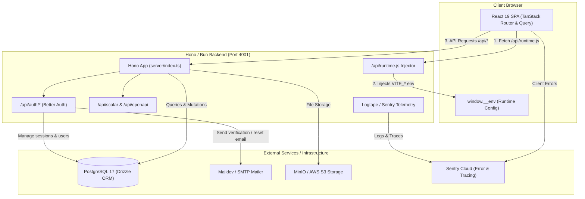

# System Architecture

This document provides a comprehensive technical breakdown of the **React + Hono Template** architecture, design patterns, data flows, and infrastructure integration.

---

## 1. System Overview

The application is structured as a unified full-stack TypeScript repository. It runs a **React 19** Single Page Application (SPA) on the frontend, served and backed by a lightweight, high-performance **Hono** web framework running natively on the **Bun** runtime.



---

## 2. Directory & Package Module Boundaries

The codebase uses Node.js subpath imports (`imports` in `package.json`) to enforce clean architectural boundaries between server, client, and shared logic without reliance on fragile relative paths:

```json
"imports": {
  "#server/*": "./server/*",
  "#client/*": "./src/*",
  "#shared/*": "./shared/*"
}
```

### Module Responsibilities

| Subpath Alias           | Scope           | Dependencies & Rules                                                                              |
| :---------------------- | :-------------- | :------------------------------------------------------------------------------------------------ |
| `#client/*` (`src/`)    | React Frontend  | Runs in browser context. May import `#shared/*`. **Must never import `#server/*` code.**          |
| `#server/*` (`server/`) | Hono Backend    | Runs on Bun runtime. Handles database, auth, email, S3, API routes. May import `#shared/*`.       |
| `#shared/*` (`shared/`) | Universal Logic | Pure TypeScript definitions, schemas, utilities (e.g., Logtape logging configuration, constants). |

---

## 3. Runtime Environment Injection (`/api/runtime.js`)

A common limitation of modern frontend build tools (such as Vite) is that environment variables starting with `VITE_` are inlined at **build time**. In containerized environments (Docker / Kubernetes), building separate images for development, staging, and production violates the "Build Once, Deploy Anywhere" principle.

### How It Works

To solve this, the template dynamically injects environment variables into the client runtime via a server-rendered JavaScript endpoint:

```
[Server Start] ──► Reads system process.env ──► Filters keys matching VITE_*
                                                           │
[Client Load] ◄── GET /api/runtime.js ◄────────────────────┘
       │
Sets window.__env
       │
[src/env.ts] ──► Fallback: window.__env?.VAR ?? import.meta.env.VAR
```

1. **Server Endpoint (`server/index.ts`)**:

   ```typescript
   app.get("/api/runtime.js", c => {
     const clientEnv = Object.fromEntries(
       Object.entries(env).filter(([key]) => key.startsWith("VITE_"))
     );
     return c.text(`window.__env = ${JSON.stringify(clientEnv, null, 2)}`, 200, {
       "Content-Type": "application/javascript",
     });
   });
   ```

2. **Client HTML Loading (`index.html`)**:

   ```html
   <script type="text/javascript" src="/api/runtime.js"></script>
   ```

3. **Client Env Access (`src/env.ts`)**:
   ```typescript
   export const env: Env = {
     VITE_APP_URL: window.__env?.VITE_APP_URL ?? import.meta.env.VITE_APP_URL,
     VITE_SENTRY_DSN: window.__env?.VITE_SENTRY_DSN ?? import.meta.env.VITE_SENTRY_DSN,
   };
   ```

### Security Guardrails

- Only environment variables explicitly prefixed with `VITE_` are filtered and served by `/api/runtime.js`.
- Server secrets (such as `DATABASE_URL`, `BETTER_AUTH_SECRET`, `SMTP_PASS`) are strictly excluded from client payload generation.

---

## 4. Frontend Architecture

The frontend is a modern React 19 application built with Vite and Tailwind CSS v4.

- **Routing (`src/routes/`)**: Managed by **TanStack Router**, providing full TypeScript route safety and auto-generated route trees (`src/routeTree.gen.ts`).
- **State & Data Fetching**: Managed by **TanStack Query (v5)** for caching, invalidation, background updating, and optimistic UI updates.
- **Styling & UI Components (`src/components/`)**:
  - **Tailwind CSS v4** via `@tailwindcss/vite`.
  - **Radix UI** primitives and **shadcn/ui** reusable components.
  - Lucide React icons, Sonner toast notifications, and Recharts visualization.
- **Theming**: Design tokens live in `src/globals.css` (Tailwind v4 `@theme`), following the visual identity defined in [`DESIGN.md`](../DESIGN.md) — a monochrome palette with Inter Variable for UI text, a monospace display voice, and light/dark themes toggled by **next-themes** (`class` strategy). A pre-paint inline script in `index.html` applies the stored theme before first render.
- **Form Validation**: Managed by **TanStack Form** or **React Hook Form** paired with **Zod** schema validation.

---

## 5. Backend Architecture

The backend is built with **Hono**, a high-performance web framework designed for edge and server runtimes.

- **Runtime**: Executed via **Bun** for native performance, fast startup, and native TypeScript execution.
- **API Route Division**:
  - `/health`: System health monitoring.
  - `/api/runtime.js`: Dynamic client environment configuration.
  - `/api/auth/*`: Better Auth handlers for user management and authentication.
  - `/api/openapi` & `/api/scalar`: Automatic OpenAPI 3.0 specification generation (`hono-openapi`) and interactive Scalar API explorer UI.
- **Error Handling & Middleware**:
  - Global error handler (`app.onError`) formats validation failures (`400 Bad Request`) and uncaught exceptions (`500 Internal Server Error`).
  - Structured request timing middleware logs HTTP completion metrics (`durationMs`, `status`, `method`, `path`).

---

## 6. Database & Authentication Architecture

### Database Layer

- **PostgreSQL 17**: Primary relational database storage.
- **Drizzle ORM**: Type-safe ORM located under `server/database/`. Schema definitions and migrations are configured via `drizzle.config.ts`.
- **Database Connection Pool**: Managed via `postgres` driver in `server/lib/db.ts`.

### Authentication Layer

- **Better Auth (`server/lib/auth.ts`)**: Production-ready authentication engine configured with Drizzle ORM PostgreSQL adapter.
- **Features**:
  - Email and Password authentication enabled by default.
  - Email verification and password reset hooks integrated with Nodemailer SMTP.
  - Interactive OpenAPI authentication documentation plugin attached at `/api/auth/docs`.
  - Client schema generation via `@better-auth/cli` (`server/database/auth.ts`).

---

## 7. Observability & Telemetry

Observability is built-in across both client and server tiers:

```
                  ┌───────────────────────────────┐
                  │    Logtape Logging Manager    │
                  └──────────────┬────────────────┘
                                 │
                 ┌───────────────┴───────────────┐
                 ▼                               ▼
      ┌────────────────────┐          ┌────────────────────┐
      │   Console Sink     │          │    Sentry Sink     │
      │ (Formatted JSON /  │          │ (@logtape/sentry)  │
      │ Dev Logs)          │          └──────────┬─────────┘
      └────────────────────┘                     │
                                                 ▼
                                      ┌────────────────────┐
                                      │ Sentry Cloud DSN   │
                                      └────────────────────┘
```

- **Structured Logging**: Powered by **Logtape** (`shared/logger.ts`), operating synchronously or asynchronously with custom log sinks.
- **Error & Performance Tracking**: Powered by **Sentry**:
  - `@sentry/bun` instruments the Hono backend server, capturing uncaught exceptions and tracing HTTP requests via `Sentry.honoIntegration()`.
  - `@sentry/react` instruments client-side rendering errors and performance metrics.
  - `@sentry/vite-plugin` uploads source maps automatically during production builds when Sentry environment variables are provided.

---

## 8. Build & Distribution Pipeline

Production builds combine backend JavaScript bundling with static asset production:

```
bun build --minify --sourcemap --target=bun --outdir=dist server/index.ts
                 │
                 ├──► Generates: dist/index.js (Backend executable)
                 │
vite build
                 │
                 └──► Generates: dist/static/ (Frontend bundle + index.html)
```

During production execution (`bun start`):

1. Bun runs `dist/index.js`.
2. Hono serves API routes at `/api/*`.
3. Hono serves static assets from `dist/static/` via `serveStatic`.
4. Fallback wildcard route `*` returns `dist/static/index.html` for client SPA routing.
